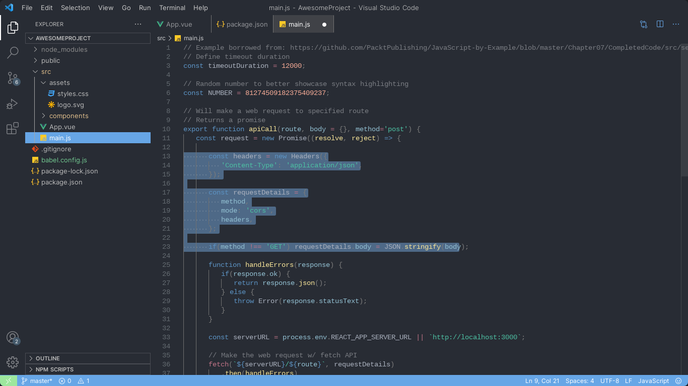

# Goodnight for [Visual Studio Code](http://code.visualstudio.com)

> A dark theme for [Visual Studio Code](http://code.visualstudio.com).

## Install

- Go to View -> Command Palette or press Ctrl+Shift+P
- Then enter Install Extension
- Write Goodnight
- Select it or press Enter to install

## Contributing

If you'd like to contribute to this theme, please read the [contributing guidelines](./CONTRIBUTING.md).
